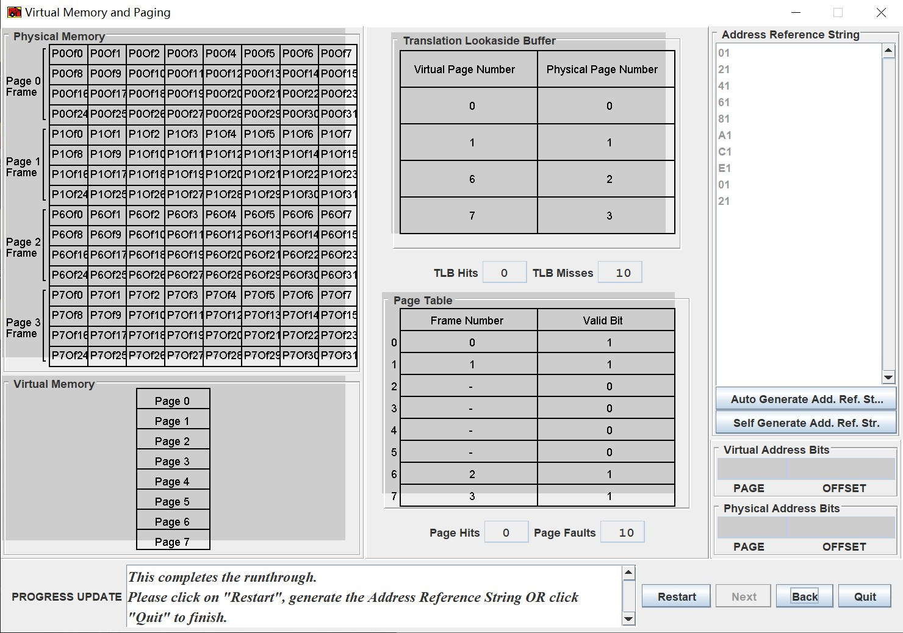

On Windows, you can simply double click the `.jar` file, and the program works! it works!!!

You no longer need to write a stuuuuuuupid `run.sh` to make it run. haha

For the `logisim`: Double click could do the same: run it. But the `-noupdates` argument would not be provided. You can connect to the VPN to enjoy it.

**BUT THE PROJECT 2 HAS ENDED!!! fUck**

## ex1.

The `Address Reference String`:
```
88
0C
06
72
28
40
D5
BB
B1
47
```
> Given the way the address was broken down, how big are the pages in this model?
> 
3 bits for PAGE, 5 bits for offset, so a page consists of $2^5=32$ Bytes.


> How many TLB Hits and Misses did we have for the randomly generated set of ten addresses? What about for Page Hits and Page Faults?

`3` TLB Hits, `7` TLB Misses;  
`0` Page Hits, `7` Page Faults.

> Did you have any Page Hits? Explain why. Can you think of a set of ten addresses that would result in a Page Hit?

No page hit.  
Only when we cannot find the VPN-PPN pair inside TLB (which is, a TLB miss), we dig into the Page Table to see, if the Page of VPN has a corresponding frame.  
However, since there are **4** frames in total, and the TLB has the place for the recording of **also 4** frames, also the Page Table only stores 4 valid frames, so we can say:  
If we have a TLB miss, then inside the Page Table, the corresponding index would be invalid.  
So there is no example to make it a page hit.

> Explain the process by which we turn a virtual address into a physical address for the very first access (emphasizing on TLB Misses and Page Faults).
1. split the address into `Page number(VPN)` & `Offset`.
2. Use `VPN` to look up the TLB: a TLB miss would always happen. Go to Page Table.
3. Inside Page Table: Also, a Page Fault would always happen. Go to the disk.
4. Fetch the page from disk, into the physical memory. Find a frame to store the page.
5. Based on `Offset`, find the desired content, and return.
6. Write the TLB and the page table.

## ex2.
Let's make a 8-item loop, based on the first 3 bits (VPN): 000, 001, 010, 011, 100, 101, 110, 111. It's enough.
```
01
21
41
61
81
A1
C1
E1

01
21
```


Reason:

01 21 41 61 takes up the 4 frames. For the next 4 pages, the overwrite must happen.  
So 81 A1 C1 E1 overwrite these 4 frames. All of them are TLB miss -> Page Fault.  
However, when we loop back to the last 01 21, the original ones are overwritten and TLB miss -> Page Fault happens again.

## ex3.
Only enlarge the Physical Memory (i.e. having more frames), but **NOT** enlarge the TLB. Then, we can let the 8 pages all stored in the physical memory, but some of them still can't be find/searched in the TLB.  
Still, 10 TLB misses should be performed. However, after the TLB miss, inside the Page Table, we still can find the corresponding frame number (given Page number), resulting in Page Hit. (If 8 pages can all be stored inside RAM, then the last 2 strings should have a page hit.)